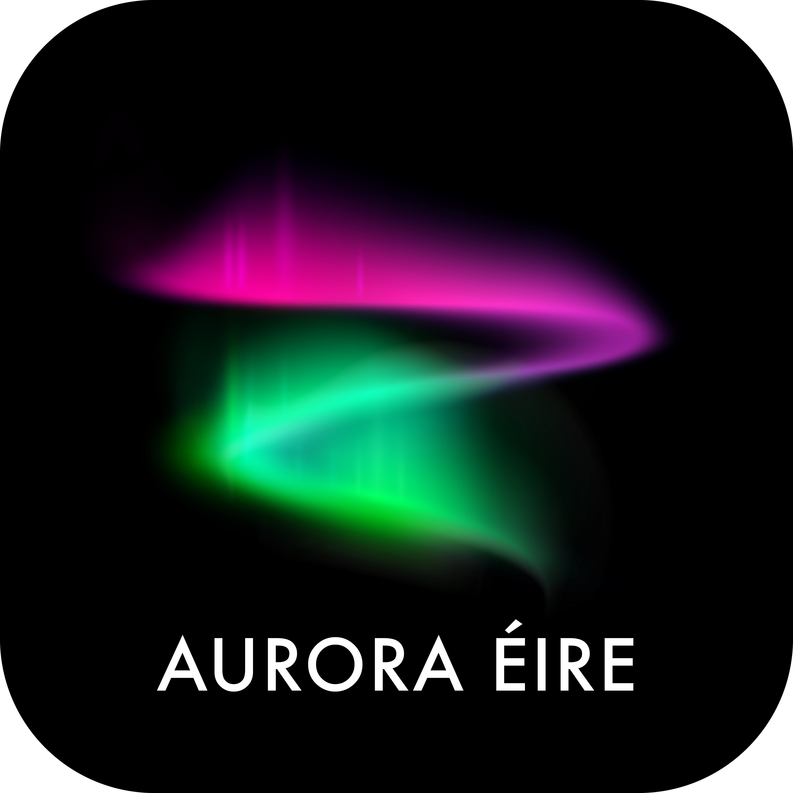

<h1 align="center"> :high_brightness: :earth_africa: Aurora Éire :milky_way: :globe_with_meridians: </h1> 

  

**Work in progress**

This package is code to read and analyse data from the Aurora Éire citizen science project. The project is described in full [here](https://www.dias.ie/cosmicphysics/astrophysics/aurora-eire/).

**License:** ??

## Required Packages

TBC

Developed using Python 3.12.11. 

## Acknowledgements

[ARF](https://github.com/arfogg)'s work at DIAS was supported by Taighde Éireann - Research Ireland Laureate Consolidator award SOLMEX to [CMJ](https://github.com/caitrionajackman).
